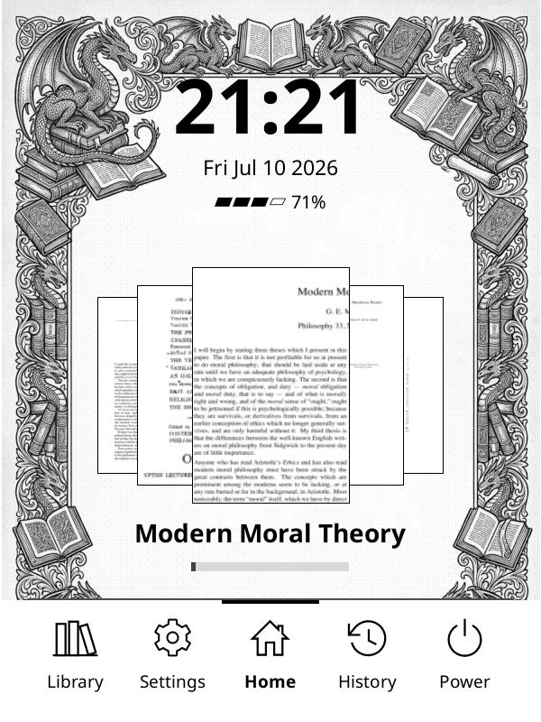
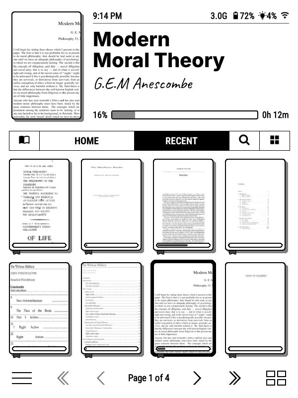
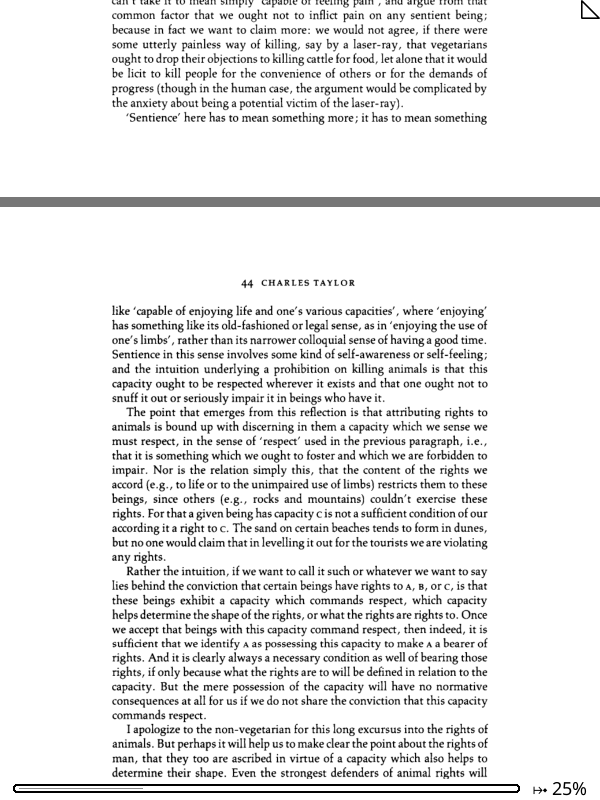
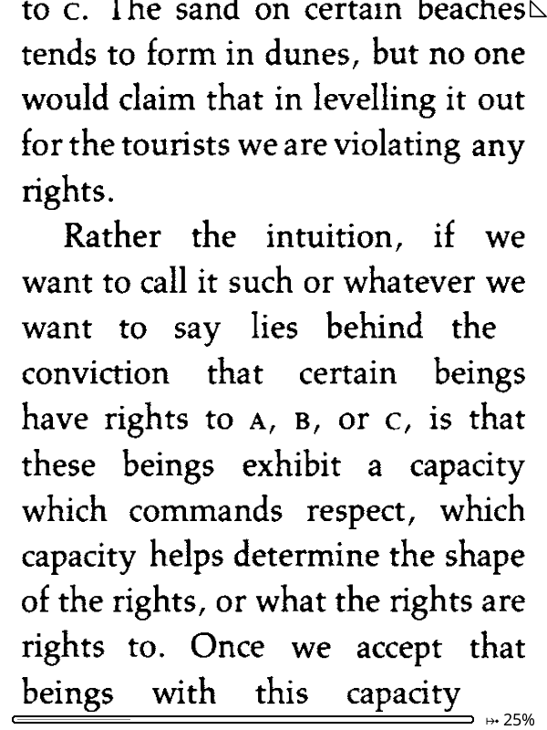

I jailbroke my Kindle over the weekend. It's been on my mind for a while. I'd been putting it off because I was afraid I'd brick it. I have an old basic Kindle, the 10th gen one.

The main thing that pushed me to finally do it was the friction of adding books to it. The chore of finding a matching USB cable, connecting the Kindle and adding books was causing my reading to drop off.

I'd wanted to jailbreak before, but I'd accidentally turned on my WiFi at one point and Amazon automatically updated my firmware to a version that couldn't be jailbroken. From then on I had used it without ever turning the WiFi on so that once a jailbreak is found, I could at least jailbreak this firmware version. And in 6 months WinterBreak was released.

The instructions for jailbreaking could be found [here](https://kindlemodding.org). The first thing I did was check the firmware, under Settings then Device Info. Mine read 5.17.1, and WinterBreak works for this version. The WinterBreak guide is pretty easy to follow with detailed steps and screenshots. One thing to watch out for is, there's an inital step to fill the Kindle with a large dummy file so there's less than 20 MB of free space left. If that's not done, there's a chance that doing the jailbreak the device might get upgraded to the latest firmware, blocking the jailbreak.

After the WinterBreak files are copied, restart the Kindle, open the store, click the WinterBreak button, and the jailbreak is installed.

The WinterBreak icon did not appear for me and after a bit of searching I found that this happens if the device name has spaces or special characters in it. Once I fixed that, the button appeared and pressing it triggered the jailbreak. After jailbreaking, you copy over the KUAL files (the launcher), and apply a patch to block future updates from Amazon. At that point the jailbreak steps are over and other apps can be installed safely.

Naturally, the first one is KOReader, the reason most people mention as the reason for jailbreaking.

The main benefits I saw in KOReader were these.

It allows me to install plugins, which could be a lot of things from UI changes to full blown apps like RSS reader.

I installed two launcher plugins. The first one was simpleUI.

I also installed Bookshelf. Both of them look better than the stock UI.

Secondly, it allows reflowing pdfs. If I open a pdf, this is how it'd normally render.

but if I turn on reflow from KOReader and increase the sizes, it'd look like this. A lot more readable.

KOReader supports gesture controls, like I could turn on or off the backlight by tapping on the bottom left corner. This is very helpful because if I happen to turn on my Kindle in darkness, I don't need to see the screen to turn on the backlight.

It allows running an SSH server from my kindle. This allows me to mount it as a directory on my laptop and work with the files.

It works with the Calibre server as well. I could turn on the wireless server from Calibre and KOReader has a setting to connect to it. This lets me send book from my Calibre to Kindle over the WiFi.

Plus it supports dark mode as well.

Another plugin I installed was QuickRSS, which lets me fetch my RSS feeds over the internet and read them on the Kindle. Earlier I had to do it in Calibre and copy it over manually.

QuickRSS was a bit clunky as it was fetching all my feeds anew every time. I edited the code to fetch only the newer feeds, and I'm running my custom version for now. If it works fine, I might raise a PR to the original project.

The only minor issue—though I'm not entirely sure about this—is that sometimes the normal Kindle UI feels slightly slower or a bit more flaky after jailbreaking. It could just be perception, though.

Also, when using KOReader, it doesn't support AZW files (Amazon's proprietary format), and a lot of my existing books were in that format. EPUBs work but it was slow to render when changing font sizes etc. I've settled on using MOBI files, which KOReader handles quickly and smoothly.

Was it worth it? Definitely. I could never go back to using a kindle the way I used to. Would I recommend everyone to do it? If your kindle is not under warranty, definitely. The chances of bricking a kindle while jailbreaking is comparitively low, so thereos not a lot of risk involved.
